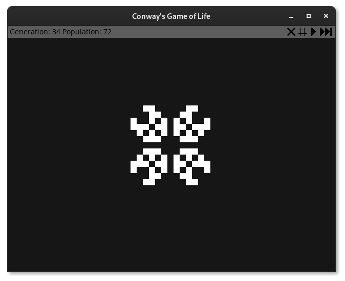

# Game of Life
This is my own implementation of [Conway's Game of Life](https://en.wikipedia.org/wiki/Conway%27s_Game_of_Life) written in C++ and using the [SDL](https://www.libsdl.org/) library.

## How does it look?

## Build process
### Requirements
1. CMake 3.16 or better.
2. A C++17 compatible compiler.
3. SDL 2.0.12, SDL_image 2.0.5 and SDL_ttf 2.0.15 or better.
4. You have to provide any sans-serif (named `font.ttf`) in the `build` folder.

### How to compile
1. Clone this repository.
2. To configure: `cmake -S . -B build`
5. To build: `cmake --build build --parallel $(nproc)`